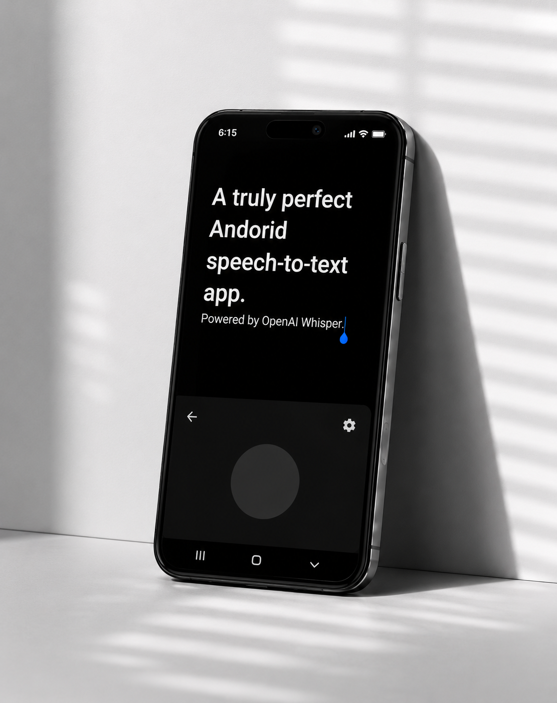

# Whispey STT

Whispey STT is a minimal Android voice-to-text keyboard powered by the OpenAI transcription API. It registers as a custom Input Method Editor (IME), records speech in memory, sends a WAV buffer to `gpt-4o-mini-transcribe`, and commits the transcribed text into the active text field.



## Features

- Custom Android IME with no traditional keyboard keys.
- Single centered recording button on a near-black keyboard surface.
- `AudioRecord` capture using PCM 16-bit, 16 kHz, mono.
- In-memory WAV encoding; no audio files, temp files, MediaStore entries, cache files, or local databases.
- `gpt-4o-mini-transcribe` transcription through OkHttp multipart upload.
- Multilingual transcription prompt that preserves spoken languages without translation.
- API key stored with `EncryptedSharedPreferences`.
- Runtime microphone permission flow.
- Optional soft haptic feedback.
- Back button to return to the previous input method.

## Requirements

- Android 8.0 or newer.
- OpenAI API key with access to the Whisper transcription API.

## Setup

1. Install the APK.
2. Open Whispey STT once and grant microphone permission.
3. Open the app settings and save your OpenAI API key.
4. Enable Whispey STT under Android keyboard settings.
5. Select Whispey STT from the keyboard selector.

## Build

Build the debug APK from the project root:

```bash
./gradlew assembleDebug
```

The debug APK is generated at:

```text
app/build/outputs/apk/debug/app-debug.apk
```

## Privacy

Whispey STT does not persist audio locally. Audio is held in memory only for the current recording session, encoded to WAV in memory, sent to the OpenAI transcription endpoint, and then discarded.

## License

MIT
